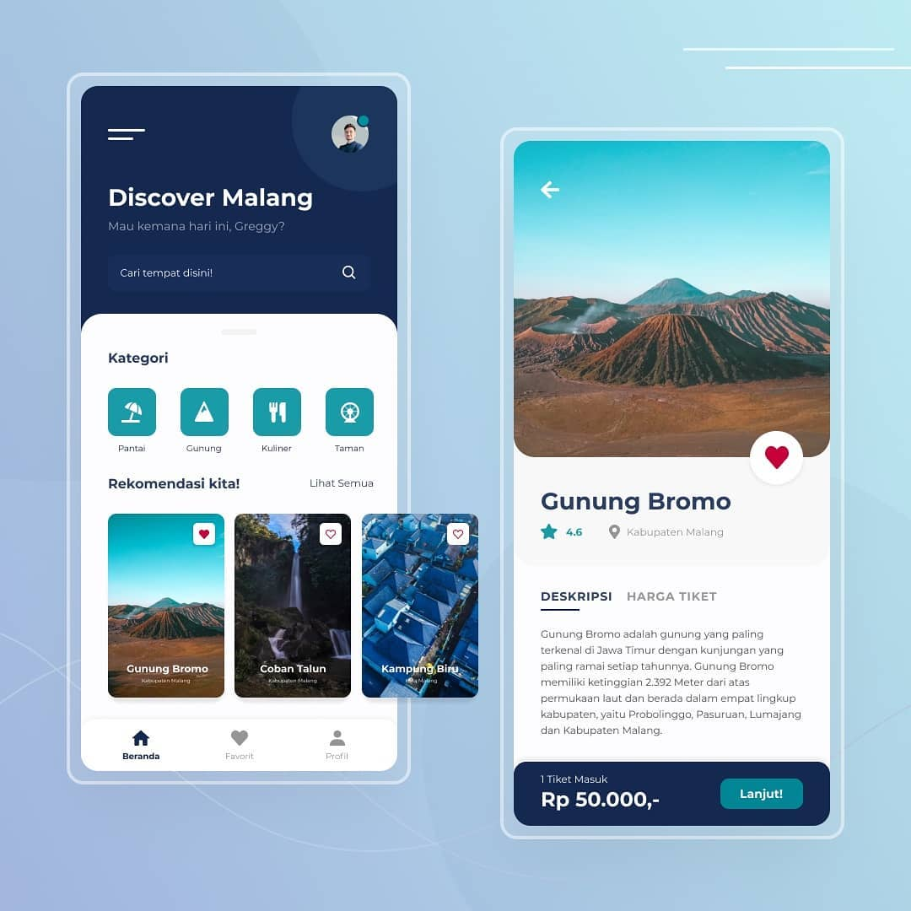
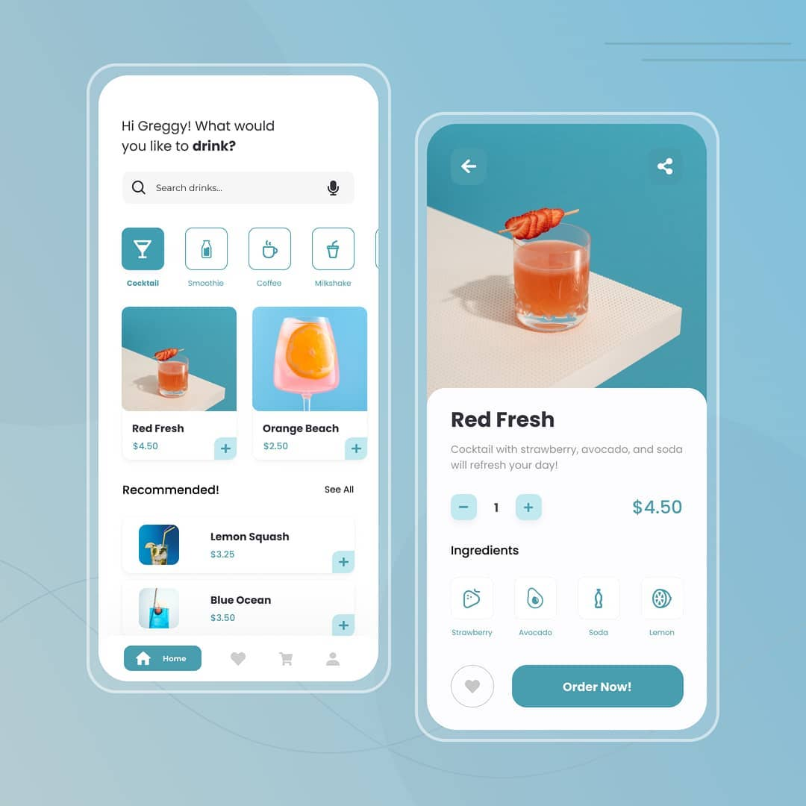

# Assalamu'alaikum 👋

Bismillah.

Halo teman-teman! Selamat datang di profil GitHubku! Kalian yang membutuhkan resource **_tugas-tugas seputar anak teknik informatika_**, kalian bisa melihat-lihat beberapa repository saya!

## Apa saja peraturannya?

**_FREE!_** Kalian bisa memakai tugasku sebagai tugas perkuliahanmu, asalkan kalian ganti-ganti beberapa ya hehe. Semoga bermanfaat!

### Apa yang saya fokuskan? Kenapa gak ngoding lagi?

Saya sekarang insyaa Allah dengan izin Allah Ta'ala akan memfokuskan ke bidang **_User Interface_** dan **_User Experience_** hehe. Ini sebagian hasil karya saya!

  
  

## Mau menghubungi saya? Silahkan!

[Instagram](https://instagram.com/greggygf)

[LinkedIn](https://www.linkedin.com/in/greggygf/)

[Dribbble](https://www.dribbble.com/greggygf)
<!--
**greggygf/greggygf** is a ✨ _special_ ✨ repository because its `README.md` (this file) appears on your GitHub profile.

Here are some ideas to get you started:

- 🔭 I’m currently working on ...
- 🌱 I’m currently learning ...
- 👯 I’m looking to collaborate on ...
- 🤔 I’m looking for help with ...
- 💬 Ask me about ...
- 📫 How to reach me: ...
- 😄 Pronouns: ...
- ⚡ Fun fact: ...
-->
